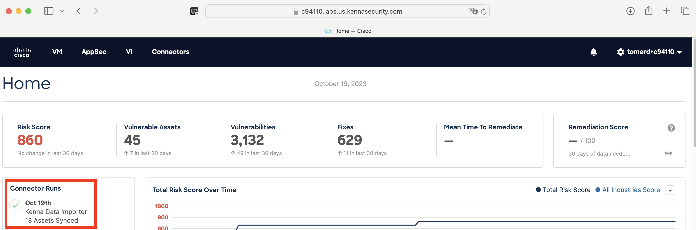

## Kenna connector for Cisco Panoptica

Import assets' vulnerability data from Cisco Panoptica into Kenna (Cisco Vulnerability Management) using KDI (Kenna Data Importer, https://help.kennasecurity.com/hc/en-us/articles/360026413111). In `kenna_screenshots` directory, there are Kenna GUI screenshots of Panoptica's image assets and vulnerabilities data imported into Kenna using the KDI json in `panoptica_kdi.json`.

Components of Panoptica connector:


Steps to run this connector:

 - install ruby version `3.2.2`
   - ubuntu: install ruby using `rbenv` and `ruby-build` plugin, refer https://github.com/rbenv/rbenv#basic-git-checkout and https://github.com/rbenv/rbenv#installing-ruby-versions (run `rbenv install 3.2.2` to install Ruby `3.2.2`)
   - macOS: refer https://www.ruby-lang.org/en/documentation/installation/#homebrew

 - run this connector
    ```
    git clone git@github.com:vhosakot/toolkit.git
    cd toolkit
    git checkout panoptica_connector
    bundle install
    
    $ ruby --version
    ruby 3.2.2 (2023-03-30 revision e51014f9c0) [x86_64-linux]
    
    $ bundle exec ruby ./toolkit.rb task=panoptica panoptica_apikeyid=ec16c781-9f95-4a56-9ea4-906b31ef6baa panoptica_apisecret=jYzn8jCzf4PHU/dwJYyMfQ2vDiFXkhOBn0dDAZnYbCE= panoptica_api_host=appsecurity.cisco.com
    Running: Kenna::Toolkit::PanopticaTask
    [+] (20231019153758) Setting kenna_batch_size to default value: 1000
    [+] (20231019153758) Converting kenna_batch_size with input value nil to 1000.
    [+] (20231019153758) Setting kenna_api_host to default value: api.kennasecurity.com
    [+] (20231019153758) Setting output_directory to default value: output/panoptica
    [+] (20231019153758) Got option: task: panoptica
    [+] (20231019153758) Got option: panoptica_apikeyid: e*******baa
    [+] (20231019153758) Got option: panoptica_apisecret: j*******CE=
    [+] (20231019153758) Got option: panoptica_api_host: appsecurity.cisco.com
    [+] (20231019153758) Got option: kenna_batch_size: 1000
    [+] (20231019153758) Got option: kenna_api_host: api.kennasecurity.com
    [+] (20231019153758) Got option: output_directory: output/panoptica
    [+] (20231019153758) 
    [+] (20231019153758) Launching the PANOPTICA task!
    [+] (20231019153758) 
    
    creating KDI for 18 images
    
      creating KDI for image asset, image ID: 28ae66d3-a91d-4c30-be8b-d3ef1b31022e
        creating KDI for 30 vulnerabilities
        creating KDI for vulnerability ID 6ce05dcd-2971-4af6-b4cd-59266c9d334b
    ...
    
    number of assets in KDI = 60
    number of vuln_defs in KDI = 49
    Cisco Panoptica KDI that can be uploaded to Kenna is created at output/panoptica/panoptica_kdi.json
    
    $ ls -l output/panoptica/panoptica_kdi.json 
    -rw-r--r-- 1 ubuntu ubuntu 104846 Oct 19 15:38 output/panoptica/panoptica_kdi.json
    
    # see Panoptica KDI json that can be uploaded to Kenna
    cat output/panoptica/panoptica_kdi.json | jq
    ```

 - after running the Panoptica connector, the KDI json file will be created at `output/panoptica/panoptica_kdi.json` and it can be uploaded to Kenna. Login into Kenna at https://c94110.labs.us.kennasecurity.com using Cisco CEC SSO login credentials, click on “Connectors” at top, click on “Upload & Run” next to “Kenna Data Importer”, select the KDI json file created by Panoptica connector and upload it to Kenna:
    
    
    
    Wait few minutes and click on the Cisco logo at top left and you should see the KDI json file has been uploaded successfully to Kenna:
    
    
    
    See screenshots of Panoptica's image assets and vulnerabilities data imported into Kenna GUI in `kenna_screenshots` directory.
